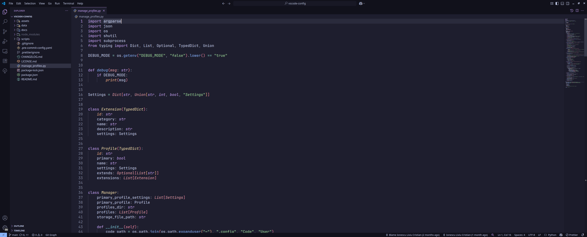

# VS Code config



## Table of Contents

- [About this project](#about-this-project)
- [Installation](#installation)
- [List of available profiles](#list-of-available-profiles)
  - [Enhanced](#enhanced)
  - [Laravel with Vue](#laravel-with-vue)
  - [PHP](#php)
  - [Python](#python)
  - [Vue](#vue)
  - [Vue (legacy)](#vue-legacy)
- [Developing](#developing)

## About this project

This project provides a structured and customizable Visual Studio Code environment tailored for modern development workflows. It offers a range of pre-configured profiles for popular tech stacks like Laravel with Vue, Python, React, and more—each designed to enhance productivity, enforce consistency, and support best practices.

The configuration includes essential editor settings, themes, and an extensive collection of curated extensions to streamline coding, debugging, linting, formatting, and version control. Developers can easily install or uninstall profiles using a command-line tool, allowing for seamless setup across different projects or teams.

Whether you're working with PHP, JavaScript, Python, or modern front-end frameworks, this setup helps you stay focused with a clean interface, useful automation, and optimized tooling.

## Installation

```bash
# Install profiles
python manage_profiles.py --install

# Uninstall profiles
python manage_profiles.py --uninstall
```

## List of available profiles

### Enhanced

```json
{
  "editor.codeActionsOnSave": {
    "source.addMissingImports": "explicit"
  },
  "editor.fontFamily": "'JetBrainsMonoNL Nerd Font Mono', 'monospace', monospace",
  "editor.fontSize": 18,
  "editor.formatOnPaste": true,
  "editor.formatOnSave": true,
  "editor.linkedEditing": true,
  "editor.stickyScroll.enabled": false,
  "files.autoSave": "afterDelay",
  "files.insertFinalNewline": true,
  "git.enableSmartCommit": true,
  "git.openRepositoryInParentFolders": "always",
  "javascript.preferences.importModuleSpecifier": "non-relative",
  "typescript.preferences.importModuleSpecifier": "non-relative",
  "workbench.startupEditor": "none"
}
```

- [Better Comments](https://marketplace.visualstudio.com/items?itemName=aaron-bond.better-comments): Improve your code commenting by annotating with alert, informational, TODOs, and more!

- [Catppuccin for VSCode](https://marketplace.visualstudio.com/items?itemName=Catppuccin.catppuccin-vsc): Soothing pastel theme for VSCode

```json
{
  "editor.semanticHighlighting.enabled": true,
  "gopls": {
    "ui.semanticTokens": true
  },
  "terminal.integrated.minimumContrastRatio": 1,
  "window.titleBarStyle": "custom",
  "workbench.colorTheme": "Catppuccin Mocha"
}
```

- [Catppuccin Icons for VSCode](https://marketplace.visualstudio.com/items?itemName=Catppuccin.catppuccin-vsc-icons): Soothing pastel icon theme for VSCode

```json
{
  "workbench.iconTheme": "catppuccin-mocha"
}
```

- [Code Spell Checker](https://marketplace.visualstudio.com/items?itemName=streetsidesoftware.code-spell-checker): Spelling checker for source code

```json
{
  "cSpell.diagnosticLevel": "Hint"
}
```

- [DotENV](https://marketplace.visualstudio.com/items?itemName=mikestead.dotenv): Support for dotenv file syntax

```json
{
  "files.associations": {
    "*.env.*": "dotenv"
  }
}
```

- [Error Lens](https://marketplace.visualstudio.com/items?itemName=usernamehw.errorlens): Improve highlighting of errors, warnings and other language diagnostics

```json
{
  "errorLens.excludeBySource": [
    "cSpell"
  ]
}
```

- [ESLint](https://marketplace.visualstudio.com/items?itemName=dbaeumer.vscode-eslint): Integrates ESLint JavaScript into VS Code

```json
{
  "editor.codeActionsOnSave": {
    "source.fixAll.eslint": "explicit"
  }
}
```

- [Even Better TOML](https://marketplace.visualstudio.com/items?itemName=tamasfe.even-better-toml): Fully-featured TOML support

- [Git Blame](https://marketplace.visualstudio.com/items?itemName=waderyan.gitblame): See git blame information in the status bar

- [Git Graph](https://marketplace.visualstudio.com/items?itemName=mhutchie.git-graph): View a Git Graph of your repository, and perform Git actions from the graph

- [Git History](https://marketplace.visualstudio.com/items?itemName=donjayamanne.githistory): View git log, file history, compare branches or commits

- [GitHub Copilot](https://marketplace.visualstudio.com/items?itemName=GitHub.copilot): Your AI pair programmer

- [GitHub Copilot Chat](https://marketplace.visualstudio.com/items?itemName=GitHub.copilot-chat): AI chat features powered by Copilot

- [GitHub Pull Requests](https://marketplace.visualstudio.com/items?itemName=GitHub.vscode-pull-request-github): Pull Request and Issue Provider for GitHub

- [GitLab Workflow](https://marketplace.visualstudio.com/items?itemName=GitLab.gitlab-workflow): Official GitLab-maintained extension for Visual Studio Code

- [Gremlins tracker for Visual Studio Code](https://marketplace.visualstudio.com/items?itemName=nhoizey.gremlins): Reveals some characters that can be harmful because they are invisible or looking like legitimate ones. Inspired by Sublime Gremlins

- [Hungry Delete](https://marketplace.visualstudio.com/items?itemName=jasonlhy.hungry-delete): To delete an entire block of whitespace or tab, and reduce the time programmers need to press backspace

- [Import Cost](https://marketplace.visualstudio.com/items?itemName=wix.vscode-import-cost): Display import/require package size in the editor

- [IntelliCode](https://marketplace.visualstudio.com/items?itemName=VisualStudioExptTeam.vscodeintellicode): AI-assisted development

- [JavaScript Booster](https://marketplace.visualstudio.com/items?itemName=sburg.vscode-javascript-booster): Boost your productivity with advanced JavaScript/TypeScript refactorings and commands

- [Markdown All in One](https://marketplace.visualstudio.com/items?itemName=yzhang.markdown-all-in-one): All you need to write Markdown (keyboard shortcuts, table of contents, auto preview and more)

- [markdownlint](https://marketplace.visualstudio.com/items?itemName=DavidAnson.vscode-markdownlint): Markdown linting and style checking for Visual Studio Code

- [Path Intellisense](https://marketplace.visualstudio.com/items?itemName=christian-kohler.path-intellisense): Visual Studio Code plugin that autocompletes filenames

```json
{
  "javascript.suggest.paths": false,
  "typescript.suggest.paths": false
}
```

- [Prettier - Code formatter](https://marketplace.visualstudio.com/items?itemName=esbenp.prettier-vscode): Code formatter using prettier

```json
{
  "editor.defaultFormatter": "esbenp.prettier-vscode"
}
```

- [Pretty TypeScript Errors](https://marketplace.visualstudio.com/items?itemName=yoavbls.pretty-ts-errors): Make TypeScript errors prettier and more human-readable in VSCode

- [Remote Development](https://marketplace.visualstudio.com/items?itemName=ms-vscode-remote.vscode-remote-extensionpack): An extension pack that lets you open any folder in a container, on a remote machine, or in WSL and take advantage of VS Code's full feature set

- [SFTP](https://marketplace.visualstudio.com/items?itemName=Natizyskunk.sftp): SFTP/FTP sync

- [ShellCheck](https://marketplace.visualstudio.com/items?itemName=timonwong.shellcheck): Integrates ShellCheck into VS Code, a linter for Shell scripts

```json
{
  "shellcheck.ignorePatterns": {
    "**/*.profile": true,
    "**/*.env.*": true
  }
}
```

- [Sort JSON objects](https://marketplace.visualstudio.com/items?itemName=richie5um2.vscode-sort-json): Sorts the keys within JSON objects

- [Sort lines](https://marketplace.visualstudio.com/items?itemName=Tyriar.sort-lines): Sorts lines of text

- [Stylelint](https://marketplace.visualstudio.com/items?itemName=stylelint.vscode-stylelint): Official Stylelint extension for Visual Studio Code

```json
{
  "css.validate": false,
  "less.validate": false,
  "scss.validate": false
}
```

- [Text Power Tools](https://marketplace.visualstudio.com/items?itemName=qcz.text-power-tools): All-in-one solution with 240+ commands for text manipulation: filter lines (grep), remove lines, insert number sequences and GUIDs, sorting, change case, converting numbers, generating fake data and more

- [Todo Tree](https://marketplace.visualstudio.com/items?itemName=Gruntfuggly.todo-tree): Show TODO, FIXME, etc. comment tags in a tree view

- [XML](https://marketplace.visualstudio.com/items?itemName=redhat.vscode-xml): XML Language Support by Red Hat

- [YAML](https://marketplace.visualstudio.com/items?itemName=redhat.vscode-yaml): YAML Language Support by Red Hat, with built-in Kubernetes syntax support

```json
{
  "redhat.telemetry.enabled": false
}
```

- [YAML Sort](https://marketplace.visualstudio.com/items?itemName=PascalReitermann93.vscode-yaml-sort): YAML Sort extends VS Code to sort, format and validate YAML files

```json
{
  "vscode-yaml-sort.forceQuotes": true,
  "vscode-yaml-sort.quotingType": "\"",
  "vscode-yaml-sort.sortArrays": true
}
```

### Laravel with Vue

- [Laravel](https://marketplace.visualstudio.com/items?itemName=laravel.vscode-laravel): Official VS Code extension for Laravel

- [Tailwind CSS IntelliSense](https://marketplace.visualstudio.com/items?itemName=bradlc.vscode-tailwindcss): Intelligent Tailwind CSS tooling for VS Code

### PHP

```json
{
  "[php]": {
    "editor.wordSeparators": "`~!@#%^&*()-=+[{]}\\|;:'\",.<>/?"
  }
}
```

- [Composer](https://marketplace.visualstudio.com/items?itemName=DEVSENSE.composer-php-vscode): All-in-One composer integration, quick actions, commands, automatic installation, tasks, code lenses, diagnostics, and composer.json IntelliSense

- [PHP Debug](https://marketplace.visualstudio.com/items?itemName=xdebug.php-debug): Debug support for PHP with Xdebug

- [PHP Intelephense](https://marketplace.visualstudio.com/items?itemName=bmewburn.vscode-intelephense-client): PHP code intelligence for Visual Studio Code

### Python

```json
{
  "[python]": {
    "editor.codeActionsOnSave": {
      "source.organizeImports": "always"
    },
    "editor.defaultFormatter": "ms-python.black-formatter"
  },
  "python.analysis.autoImportCompletions": true,
  "python.analysis.typeCheckingMode": "strict",
  "python.terminal.activateEnvironment": false
}
```

- [Better Jinja](https://marketplace.visualstudio.com/items?itemName=samuelcolvin.jinjahtml): Syntax highlighting for jinja(2) including HTML, Markdown, YAML, Ruby and LaTeX templates

- [Black Formatter](https://marketplace.visualstudio.com/items?itemName=ms-python.black-formatter): Formatting support for Python files using the Black formatter

```json
{
  "black-formatter.args": [
    "--line-length",
    "120"
  ]
}
```

- [Flake8](https://marketplace.visualstudio.com/items?itemName=ms-python.flake8): Linting support for Python files using Flake8

```json
{
  "flake8.args": [
    "--max-line-length=120"
  ]
}
```

- [isort](https://marketplace.visualstudio.com/items?itemName=ms-python.isort): Import organization support for Python files using isort

```json
{
  "isort.args": [
    "--profile",
    "black"
  ]
}
```

- [Pylance](https://marketplace.visualstudio.com/items?itemName=ms-python.vscode-pylance): A performant, feature-rich language server for Python in VS Code

- [Python](https://marketplace.visualstudio.com/items?itemName=ms-python.python): Python language support with extension access points for IntelliSense (Pylance), Debugging (Python Debugger), linting, formatting, refactoring, unit tests, and more

### Vue

```json
{
  "[vue]": {
    "editor.codeActionsOnSave": {
      "source.addMissingImports": "never"
    }
  }
}
```

- [Vue - Official](https://marketplace.visualstudio.com/items?itemName=Vue.volar): Language Support for Vue

### Vue (legacy)

```json
{
  "[vue]": {
    "editor.codeActionsOnSave": {
      "source.addMissingImports": "never"
    }
  },
  "extensions.autoUpdateExceptions": [
    "Vue.volar"
  ]
}
```

- [Vue - Official](https://marketplace.visualstudio.com/items?itemName=Vue.volar): Language Support for Vue

## Developing

```bash
npm i
```
