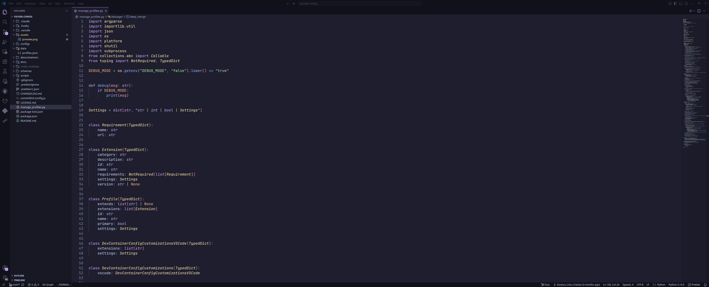

# VS Code config



## Table of Contents

- [About this project](#about-this-project)
- [Usage](#usage)
- [List of available profiles](#list-of-available-profiles)
  - [Enhanced](#enhanced)
  - [Go](#go)
  - [Grafana](#grafana)
  - [Laravel with Vue](#laravel-with-vue)
  - [PHP](#php)
  - [Python](#python)
  - [Vue](#vue)
  - [Vue (legacy)](#vue-legacy)
- [Developing](#developing)

## About this project

A collection of ready-made Visual Studio Code profiles for different kinds of development work. Instead of configuring the editor from scratch for every project, you pick a profile and get a consistent setup right away.

Each profile targets a specific stack and builds on a shared base, bundling the extensions, theme, and settings that fit it - so formatting, linting, and debugging work out of the box.

## Usage

```bash
# Install profiles
python manage_profiles.py --install

# Install extension configurations (optional)
python manage_profiles.py --install-configs

# Uninstall extension configurations
python manage_profiles.py --uninstall-configs

# Uninstall profiles
python manage_profiles.py --uninstall

# Generate devcontainer profiles
python manage_profiles.py --devcontainers
```

## List of available profiles

### Enhanced

```json
{
  "[markdown]": {
    "files.trimTrailingWhitespace": false
  },
  "[shellscript]": {
    "editor.rulers": [
      80
    ]
  },
  "chat.disableAIFeatures": true,
  "editor.codeActionsOnSave": {
    "source.addMissingImports": "explicit"
  },
  "editor.fontFamily": "'JetBrainsMonoNL Nerd Font Mono', 'monospace', monospace",
  "editor.fontSize": 18,
  "editor.formatOnPaste": true,
  "editor.formatOnSave": true,
  "editor.guides.bracketPairs": "active",
  "editor.inlayHints.enabled": "offUnlessPressed",
  "editor.linkedEditing": true,
  "editor.stickyScroll.enabled": false,
  "editor.unicodeHighlight.ambiguousCharacters": true,
  "editor.unicodeHighlight.invisibleCharacters": true,
  "files.autoSave": "onFocusChange",
  "files.insertFinalNewline": true,
  "files.trimFinalNewlines": true,
  "files.trimTrailingWhitespace": true,
  "git.blame.editorDecoration.enabled": true,
  "git.blame.ignoreWhitespace": true,
  "git.blame.statusBarItem.enabled": true,
  "git.enableSmartCommit": true,
  "git.openRepositoryInParentFolders": "always",
  "git.smartCommitChanges": "tracked",
  "js/ts.preferences.importModuleSpecifier": "non-relative",
  "workbench.settings.alwaysShowAdvancedSettings": true,
  "workbench.startupEditor": "none"
}
```

- [Bash IDE](https://marketplace.visualstudio.com/items?itemName=mads-hartmann.bash-ide-vscode): A language server for Bash
  - Requires [shfmt](https://github.com/mvdan/sh)

```json
{
  "[shellscript]": {
    "editor.defaultFormatter": "mads-hartmann.bash-ide-vscode"
  },
  "bashIde.shellcheckPath": ""
}
```

- [Better Comments Next](https://marketplace.visualstudio.com/items?itemName=EdwinHuiSH.better-comments-next): Improve your code commenting by annotating with alert, informational, TODOs, and more!

- [Better Todo Tree](https://marketplace.visualstudio.com/items?itemName=FanaticPythoner.better-todo-tree): The maintained successor to Todo Tree for VS Code: same workflow, active fixes, better compatibility, and ongoing improvements.

- [Catppuccin for VSCode](https://marketplace.visualstudio.com/items?itemName=Catppuccin.catppuccin-vsc): Soothing pastel theme for VSCode

```json
{
  "editor.semanticHighlighting.enabled": true,
  "terminal.integrated.minimumContrastRatio": 1,
  "window.titleBarStyle": "custom",
  "workbench.colorTheme": "Catppuccin Mocha"
}
```

- [Catppuccin Icons for VSCode](https://marketplace.visualstudio.com/items?itemName=Catppuccin.catppuccin-vsc-icons): Soothing pastel icon theme for VSCode

```json
{
  "workbench.iconTheme": "catppuccin-mocha"
}
```

- [Code Spell Checker](https://marketplace.visualstudio.com/items?itemName=streetsidesoftware.code-spell-checker): Spelling checker for source code

```json
{
  "cSpell.diagnosticLevel": "Hint"
}
```

- [CSS Peek](https://marketplace.visualstudio.com/items?itemName=pranaygp.vscode-css-peek): Allow peeking to css ID and class strings as definitions from html files to respective CSS. Allows peek and goto definition

- [DotENV](https://marketplace.visualstudio.com/items?itemName=mikestead.dotenv): Support for dotenv file syntax

```json
{
  "files.associations": {
    "*.env.*": "dotenv"
  }
}
```

- [EditorConfig for VS Code](https://marketplace.visualstudio.com/items?itemName=EditorConfig.EditorConfig): EditorConfig Support for Visual Studio Code

- [Error Lens](https://marketplace.visualstudio.com/items?itemName=usernamehw.errorlens): Improve highlighting of errors, warnings and other language diagnostics

- [ESLint](https://marketplace.visualstudio.com/items?itemName=dbaeumer.vscode-eslint): Integrates ESLint JavaScript into VS Code

```json
{
  "editor.codeActionsOnSave": {
    "source.fixAll.eslint": "explicit"
  }
}
```

- [Even Better TOML](https://marketplace.visualstudio.com/items?itemName=tamasfe.even-better-toml): Fully-featured TOML support

```json
{
  "[toml]": {
    "editor.defaultFormatter": "tamasfe.even-better-toml"
  }
}
```

- [Git Graph](https://marketplace.visualstudio.com/items?itemName=mhutchie.git-graph): View a Git Graph of your repository, and perform Git actions from the graph

- [GitHub Pull Requests](https://marketplace.visualstudio.com/items?itemName=GitHub.vscode-pull-request-github): Pull Request and Issue Provider for GitHub

- [GitLab Workflow](https://marketplace.visualstudio.com/items?itemName=GitLab.gitlab-workflow): Official GitLab-maintained extension for Visual Studio Code

- [Hungry Delete](https://marketplace.visualstudio.com/items?itemName=jasonlhy.hungry-delete): To delete an entire block of whitespace or tab, and reduce the time programmers need to press backspace

- [Lua](https://marketplace.visualstudio.com/items?itemName=sumneko.lua): Lua Language Server coded by Lua

```json
{
  "Lua.format.enable": false
}
```

- [Markdown All in One](https://marketplace.visualstudio.com/items?itemName=yzhang.markdown-all-in-one): All you need to write Markdown (keyboard shortcuts, table of contents, auto preview and more)

- [markdownlint](https://marketplace.visualstudio.com/items?itemName=DavidAnson.vscode-markdownlint): Markdown linting and style checking for Visual Studio Code

- [Path Intellisense](https://marketplace.visualstudio.com/items?itemName=christian-kohler.path-intellisense): Visual Studio Code plugin that autocompletes filenames

```json
{
  "js/ts.suggest.paths": false
}
```

- [Prettier - Code formatter](https://marketplace.visualstudio.com/items?itemName=esbenp.prettier-vscode): Code formatter using prettier

```json
{
  "editor.defaultFormatter": "esbenp.prettier-vscode"
}
```

- [Pretty TypeScript Errors](https://marketplace.visualstudio.com/items?itemName=yoavbls.pretty-ts-errors): Make TypeScript errors prettier and more human-readable in VSCode

- [Remote Development](https://marketplace.visualstudio.com/items?itemName=ms-vscode-remote.vscode-remote-extensionpack): An extension pack that lets you open any folder in a container, on a remote machine, or in WSL and take advantage of VS Code's full feature set

- [ShellCheck](https://marketplace.visualstudio.com/items?itemName=timonwong.shellcheck): Integrates ShellCheck into VS Code, a linter for Shell scripts

```json
{
  "shellcheck.ignorePatterns": {
    "**/*.csh": true,
    "**/*.cshrc": true,
    "**/*.env.*": true,
    "**/*.fish": true,
    "**/*.login": true,
    "**/*.logout": true,
    "**/*.profile": true,
    "**/*.tcsh": true,
    "**/*.tcshrc": true,
    "**/*.xonshrc": true,
    "**/*.xsh": true,
    "**/*.zlogin": true,
    "**/*.zlogout": true,
    "**/*.zprofile": true,
    "**/*.zsh": true,
    "**/*.zsh-theme": true,
    "**/*.zshenv": true,
    "**/*.zshrc": true,
    "**/zlogin": true,
    "**/zlogout": true,
    "**/zprofile": true,
    "**/zshenv": true,
    "**/zshrc": true
  }
}
```

- [Sort JSON objects](https://marketplace.visualstudio.com/items?itemName=richie5um2.vscode-sort-json): Sorts the keys within JSON objects

- [Sort lines](https://marketplace.visualstudio.com/items?itemName=Tyriar.sort-lines): Sorts lines of text

- [Stylelint](https://marketplace.visualstudio.com/items?itemName=stylelint.vscode-stylelint): Official Stylelint extension for Visual Studio Code

```json
{
  "css.validate": false,
  "editor.codeActionsOnSave": {
    "source.fixAll.stylelint": "explicit"
  },
  "less.validate": false,
  "scss.validate": false,
  "stylelint.validate": [
    "css",
    "postcss",
    "scss",
    "less",
    "javascriptreact",
    "typescriptreact"
  ]
}
```

- [StyLua](https://marketplace.visualstudio.com/items?itemName=JohnnyMorganz.stylua): A Lua code formatter

```json
{
  "[lua]": {
    "editor.defaultFormatter": "JohnnyMorganz.stylua"
  }
}
```

- [Text Power Tools](https://marketplace.visualstudio.com/items?itemName=qcz.text-power-tools): All-in-one solution with 240+ commands for text manipulation: filter lines (grep), remove lines, insert number sequences and GUIDs, sorting, change case, converting numbers, generating fake data and more

- [Vim](https://marketplace.visualstudio.com/items?itemName=vscodevim.vim): Vim emulation for Visual Studio Code

- [vscode-pdf](https://marketplace.visualstudio.com/items?itemName=mathematic.vscode-pdf): Display pdf files in VS Code

- [XML](https://marketplace.visualstudio.com/items?itemName=redhat.vscode-xml): XML Language Support by Red Hat

```json
{
  "[xml]": {
    "editor.defaultFormatter": "redhat.vscode-xml"
  }
}
```

- [YAML](https://marketplace.visualstudio.com/items?itemName=redhat.vscode-yaml): YAML Language Support by Red Hat, with built-in Kubernetes syntax support

```json
{
  "[yaml]": {
    "editor.defaultFormatter": "redhat.vscode-yaml"
  },
  "redhat.telemetry.enabled": false
}
```

- [YAML Sort](https://marketplace.visualstudio.com/items?itemName=PascalReitermann93.vscode-yaml-sort): YAML Sort extends VS Code to sort, format and validate YAML files

```json
{
  "vscode-yaml-sort.forceQuotes": true,
  "vscode-yaml-sort.quotingType": "\"",
  "vscode-yaml-sort.sortArrays": true
}
```

### Go

```json
{
  "[go]": {
    "editor.codeActionsOnSave": {
      "source.organizeImports": "explicit"
    },
    "editor.defaultFormatter": "golang.go"
  }
}
```

- [Go](https://marketplace.visualstudio.com/items?itemName=golang.go): Rich Go language support for Visual Studio Code

```json
{
  "go.diagnostic.vulncheck": "Imports",
  "gopls": {
    "analyses": {
      "shadow": true
    },
    "gofumpt": true,
    "semanticTokens": true,
    "staticcheck": true
  }
}
```

- [templ-vscode](https://marketplace.visualstudio.com/items?itemName=a-h.templ): Provides syntax highlighting and templ LSP integration
  - Requires [templ](https://templ.guide)

```json
{
  "[templ]": {
    "editor.defaultFormatter": "a-h.templ"
  }
}
```

### Grafana

- [Grafana Alloy](https://marketplace.visualstudio.com/items?itemName=Grafana.grafana-alloy): Grafana Alloy support

- [Jsonnet](https://marketplace.visualstudio.com/items?itemName=Grafana.vscode-jsonnet): Full code support (formatting, highlighting, navigation, debugging etc) for Jsonnet

```json
{
  "[jsonnet]": {
    "editor.defaultFormatter": "Grafana.vscode-jsonnet"
  }
}
```

### Laravel with Vue

- [Laravel](https://marketplace.visualstudio.com/items?itemName=laravel.vscode-laravel): Official VS Code extension for Laravel

- [Tailwind CSS IntelliSense](https://marketplace.visualstudio.com/items?itemName=bradlc.vscode-tailwindcss): Intelligent Tailwind CSS tooling for VS Code

### PHP

```json
{
  "[php]": {
    "editor.wordSeparators": "`~!@#%^&*()-=+[{]}\\|;:'\",.<>/?"
  }
}
```

- [Composer](https://marketplace.visualstudio.com/items?itemName=DEVSENSE.composer-php-vscode): All-in-One composer integration, quick actions, commands, automatic installation, tasks, code lenses, diagnostics, and composer.json IntelliSense

- [PHP Debug](https://marketplace.visualstudio.com/items?itemName=xdebug.php-debug): Debug support for PHP with Xdebug

- [PHP Intelephense](https://marketplace.visualstudio.com/items?itemName=bmewburn.vscode-intelephense-client): PHP code intelligence for Visual Studio Code

```json
{
  "[php]": {
    "editor.defaultFormatter": "bmewburn.vscode-intelephense-client"
  }
}
```

### Python

- [Better Jinja](https://marketplace.visualstudio.com/items?itemName=samuelcolvin.jinjahtml): Syntax highlighting for jinja(2) including HTML, Markdown, YAML, Ruby and LaTeX templates

- [Pylance](https://marketplace.visualstudio.com/items?itemName=ms-python.vscode-pylance): A performant, feature-rich language server for Python in VS Code

```json
{
  "python.analysis.autoImportCompletions": true,
  "python.analysis.typeCheckingMode": "strict"
}
```

- [Python](https://marketplace.visualstudio.com/items?itemName=ms-python.python): Python language support with extension access points for IntelliSense (Pylance), Debugging (Python Debugger), linting, formatting, refactoring, unit tests, and more

```json
{
  "python.terminal.activateEnvironment": false
}
```

- [Python Debugger](https://marketplace.visualstudio.com/items?itemName=ms-python.debugpy): Python Debugger extension using debugpy

- [Python Environments](https://marketplace.visualstudio.com/items?itemName=ms-python.vscode-python-envs): Provides a unified python environment experience

```json
{
  "python-envs.terminal.autoActivationType": "off"
}
```

- [Ruff](https://marketplace.visualstudio.com/items?itemName=charliermarsh.ruff): A Visual Studio Code extension with support for the Ruff linter and formatter for Python

```json
{
  "[python]": {
    "editor.codeActionsOnSave": {
      "source.fixAll.ruff": "explicit",
      "source.organizeImports.ruff": "explicit"
    },
    "editor.defaultFormatter": "charliermarsh.ruff"
  },
  "ruff.configurationPreference": "filesystemFirst",
  "ruff.lineLength": 120
}
```

### Vue

```json
{
  "[vue]": {
    "editor.codeActionsOnSave": {
      "source.addMissingImports": "never"
    }
  }
}
```

- [Vue - Official](https://marketplace.visualstudio.com/items?itemName=Vue.volar): Language Support for Vue

```json
{
  "vue.autoInsert.dotValue": true
}
```

### Vue (legacy)

```json
{
  "[vue]": {
    "editor.codeActionsOnSave": {
      "source.addMissingImports": "never"
    }
  }
}
```

- [Vue - Official](https://marketplace.visualstudio.com/items?itemName=Vue.volar): Language Support for Vue

## Developing

```bash
npm i
```
